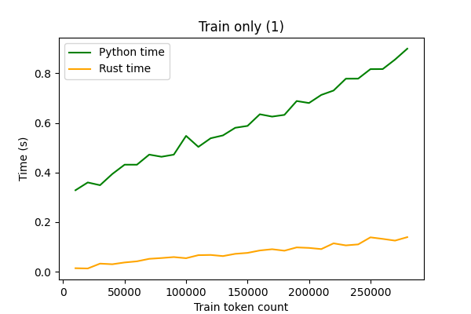
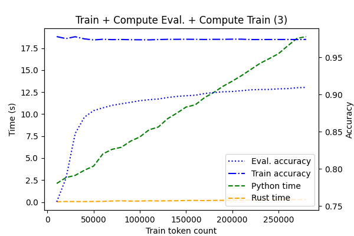

# Rust-Python HMM

For this assignment I decided to focus on the model performance. Specifically, I implemented the assignment also in Rust to see what the performance gain will be.
The reasons are that (1) I want to learn Rust but every class is Python + PyTorch and (2) current NLP research is all done by prototyping in Python, yet there is virtue in experience of programming usable solutions. Note: I don't want to be mean to Python, it certainly has its place and advantages.

I understand that the task was to programm this in Python, which I hope I fulfilled. Yet I also hope that you will find these comparison interesting. 

The Rust code is twice as large and took much longer to complete. The benefits are, however, that once it compiled, I was convinced of its functionality, which was not the case with Python.

## Project structure

```
data/                  # not supplied, paste the files here for reproducibility
 - de-{eval,train}.tt  
 - de-test.t
data_measured/
 - {r,p}-de-test.tt    # test outputs 
 - time-{1,2,3}        # measured results
 - time-{1,2,3}.png    # exported graphs
meta/                  # scripts for measuring performance and accuracy
 - graph.py            # produce graphs given logs time-{1,2,3} in data_measured
 - run_times.py        # measure performance from r-build-time and p-run-test recipes
rust/                  # Rust source code
python/                # Python source code
Makefile               # Makefile for common recipes
```

## Makefile and reproducing results

`make p-run-test` trains on the data and outputs the CONLL-U file to `data_measured/p-de-test.tt`, similarly `make r-run-test` produces `data_measured/r-de-test.tt` (assuming stable Rust compiler in path). The semantics of the rest of the command line arguments is intuitive from the Makefile: `print_acc` self-reports the accuracy on anything it computes (`comp_test`, `comp_train` or `comp_eval`).

File paths are hardcoded, because there are no plans to make this portable and there were already too many switches. If `print_pred` is present, the program outputs predictions to stdout. Progress is outputed to stderr.

## Correctness

Even though the Viterbi algorithm should be mostly deterministic, there is a big issue with number representation and rounding. There appears to be a big difference in accuracy based on the underlying numeric type used. All parameters were multiplied by `4096` in both versions, because this maximized the performance (possibly striking the sweet spot between diminishing and exploding values). Despite my best efforts, the two versions produce slightly different results. This may be due to different corner-case handling in the two systems.

Unseen tokens were dealt with by substituting the emission probability with 1, thus relying on the surrounding transition probabilities. 

I tried to use the same algorithmic steps in both solutions, so that they are comparable. It is, however, still possible, that I mistakenly used some other data structure, assuming it was the same.

## Code structure

Structures in both versions follow the same naming scheme. The programs function as follows:

1. Train `Loader` is created, which also creates a `Mapper` objects (see Note)
2. HMM Model parameters are estimated from the training data.
3. Eval or Test `Loader` is created, reusing Training `Mapper`.
4. Based on the arguments, datasets are evaluated (`comp_test`, `comp_train` or `comp_eval`).

The `HMM` class contains code for initialization and Viterbi and can be used generically. `HMMTag` inherits from this class and adds specific functions for initialization from `Loader` and evaluation. Both implementations start with `main.{rs,py}`.

## Performance

### Graphs

The performance was measured with respect to changing training data size (steps of 10000 tokens). The task was (1) train, (2) train + evaluate on eval, (3) train + evaluate on train and eval. Accuracy of these models was also measured. The measured times are without writing to files.

Figure 1 shows simply that in training, the Rust implementation seem to be faster by the factor of  ~7.



Figure 2 shows also that the Rust implementation is more stable (possibly because of the lack of runtime). We also see that there seem to be diminishing return in performance after we pass 50k train tokens. Python ends at 2.56s and Rust on 0.18s.


Evaluating the whole data proved to be the most difficult task. This is shown on Figure 3. While Python ends at 29.95s, for Rust it is 0.39s. The training accuracy is also decreasing, because the capacity of the model is getting shared with larger amount of examples. Train accuracies were 91.89% and 79.65% for Rust and Python, respectively. Evaluation accuracies were 80.40% and 72.91%. 



### Note

I did not try to especially optimize the algorithmic performance. For example the trellis is allocated and cleared for every sentence in the data. This could be done much more efficiently by creating one static one (the size of the longest sentence) and reusing that for the computation. It does not need to be cleared, because every cell is first written to and only then read.

One of the biggest performance boosts was gained by creating a hashmap mapping from string (both for words and for tags), convert everything to numbers (Rust version uses 8bytes, which is unnecesary), manipulate just these numbers and only when printing revert back.

Also both versions contain code for computing sequence observation probability in trellis (`sum` instead of `max`), but is turned off in both versions. The Rust version gets an unfair advantage in this, because it is removed compile time, while in Python the interpreter has a bit more work to do.

## Additional

The Rust code also contains the toy ice-cream X weather example. It can be run with `cargo test --nocapture`.