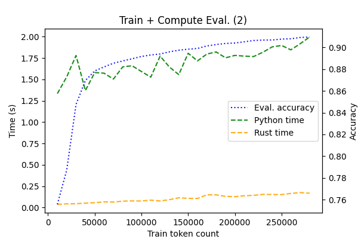

# Rust-Python HMM

For this assignment I decided to focus on the model performance. Specifically, I implemented the assignment also in Rust to see what the performance gain will be.
The reasons are that (1) I want to learn Rust but every class is Python + PyTorch and (2) current NLP research is all done by prototyping in Python, yet there is virtue in experience of programming usable solutions. Note: I don't want to bash on Python, it certainly has its place and advantages.

I understand that the task was to programm this in Python, which I hope I fulfilled. Yet I also hope that you will find these comparison interesting. 

The Rust code is twice as large and took much longer to complete. The benefits are, however, that once it compiled, I was convinced of its functionality, which was not the case with Python. 

## Correctness

TODO

I tried to use the same algorithmic steps in both solutions, so that they are comparable. It is, however, still possible, that I mistakenly used some other data structure, assuming it was the same.

## Performance

### Graphs

The performance was measured with respect to changing training data size (steps of 1000 tokens). The task was (1) train, (2) train + evaluate on eval, (3) train + evaluate on train and eval. Accuracy of these models was also measured. The measured times are without writing to files.

The first figure shows simply that in training, the Rust implementation seem to be faster by the factor of  ~7.

Second picture shows also that the Rust implementation is more stable (possibly because of the lack of runtime). We also see that there seem to be diminishing return in performance after we pass 50k train tokens. Python ends at 2.56s and Rust on 0.18s.

Evaluating the whole data proved to be the most difficult task. While Python ends at 29.95s, for Rust it is 0.39s.

### Note

I did not try to especially optimize the algorithmic performance. For example the trellis is allocated and cleared for every sentence in the data. This could be done much more efficiently by creating one static one (the size of the longest sentence) and reusing that for the computation. It does not need to be cleared, because every cell is first written to and only then read.  

## Additional

The Rust code also contains the toy ice-cream X weather example.